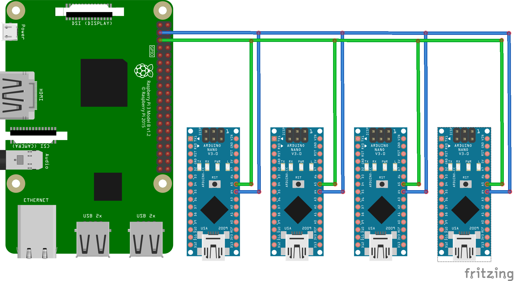

# Delta 5 Race Timer

### Description:

Multi-node video RF race timer for drone racing.  This timing system uses the video signals being broadcast by FPV racing drones to trigger a lap timer; no additional equipment required on the drone. Each receiver node is tuned to the video frequency that a drone is broadcasting on.  One receiver node is required for each frequency being tracked.  All of the receiver nodes are connected to a raspberry pi, which aggregates the data and also provides a simple GUI for the race director.

### Base Station:
* 1 x Raspberry Pi 3 (Other Raspberry Pi models should work, but this was tested on RPi3)

### Receiver Node Parts List: (this is enough for one receiver node)
* 1 x Arduino Nano
* 1 x rx5808 with SPI mod - see the SPI mod here: https://github.com/scottgchin/delta5_race_timer/blob/master/rx5808_SPI/rx5808_SPI.md
* 3 x 1k ohm resistor
* 1 x 100k ohm resistor

### Receiver Node Connection Diagram:

### Receiver Node Arduino Code:
1. Open the Delta 5 Race Timer in the Arduino IDE.
2. Change the slave ID number and the frequency settings on each Receiver Node.
  * Node 1 = slave address 8
  * Node 2 = slave address 10
  * Node 3 = slave address 12
  * Node 4 = slave address 14
3. Change the frequency to match the VTX frequency.  The below are the IMD 5 settings  
  
### Raspberry Pi setup coming soon!

### Raspberry Pi to Ardunio i2c Connection Diagram:

