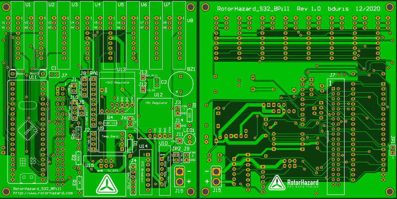
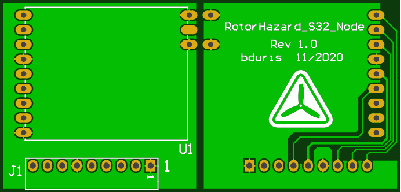

# RotorHazard S32_BPill PCB

The RotorHazard S32_BPill PCB v1.0 represents the next generation of race-timer hardware.

## Features

* Instead of multiple Arduinos, the board has a single STM32 processor

* Board size (100×100mm) is the same as the "standard" Delta5 PCBs

* Supports 1 to 8 RX5808 node modules on a single PCB

* The RX5808 node modules are mounted vertically using small sub-boards -- this allows for up to eight on a single board, and provides substantially improved cooling

* Communication between the STM32 processor and the Raspberry Pi is via serial-port link, running at 921600 baud. The S32_BPill board can also be connected directly to a computer (via USB-to-Serial/FTDI dongle)

* The STM32 processor is on a 40-pin module, attached to the board via sockets. These are commonly known as "Blue Pill" modules, and are readily available and inexpensive

* The board has a 40-pin (2x20) header for connecting to the Raspberry Pi, via a ribbon cable with female ends

* The STM32 processor is in-circuit programmable, able to be updated/flashed using the Raspberry Pi. The update can be performed via the RotorHazard web GUI using the 'Update Nodes' button (in the 'System' section on the 'Settings' page)

* The same server and node source code supports both the S32_BPill and the (existing) multi-Arduino boards

* Supports power/battery monitoring and a buzzer (low-battery alarm)

* Mounting locations for (optional) DS3231 (RTC), INA219 and BME280 modules, connected to the Raspberry Pi I2C bus

* Optional "extra" LED, which can be panel mounted on the timer case

* Connector pads for LED-strips -- one to the Raspberry Pi, one to the STM32 processor
 

  

## Resources

[RotorHazard S32_BPill PCB Schematic](files/RotorHazard_S32_BPill_SCH_R1.pdf)

[RotorHazard S32_BPill Node-board Schematic](files/RotorHazard_S32_Node_SCH_R1_0.pdf)

[Gerber files for RotorHazard S32_BPill PCB](http://www.rotorhazard.com/files/GerberFiles_RotorHazard_S32_BPill_R1.zip) &nbsp; (alternate link: [on GitHub](files/GerberFiles_RotorHazard_S32_BPill_R1.zip))

[Gerber files for RotorHazard S32_BPill Node board](http://www.rotorhazard.com/files/GerberFiles_RotorHazard_S32_Node_R1_0.zip) &nbsp; (alternate link: [on GitHub](files/GerberFiles_RotorHazard_S32_Node_R1_0.zip))

The Gerber files can be sent to a PCB manufacturer to fabricate boards. To build a timer, you will need one S32_BPill PCB, and several of the S32_BPill Node boards (one for each RX5808 module in the timer).

Bill of Materials: [PDF](files/RotorHazard_S32_BPill_R1_bd02.pdf) | [XLS](files/RotorHazard_S32_BPill_R1_bd02.xls) | [HTML](http://www.rotorhazard.com/files/RotorHazard_S32_BPill_R1_bd02.html)

[Atrium project files exported to ASCII](http://www.rotorhazard.com/files/RotorHazard_S32_BPill_R1_AltiumAscii.zip)

[CAD drawings of S32_BPill PCB](http://www.rotorhazard.com/files/RotorHazard_S32_BPill_PCB_R1.pdf)

[CAD drawings of S32_BPill Node Board](http://www.rotorhazard.com/files/RotorHazard_S32_Node_PCB_R1_0.pdf)

[PCB Build Notes](files/Build_notes.txt) and [Pin Soldering Helper](files/PinSolderingHelper.pdf) doc

[Node board assembly tips](http://www.rotorhazard.com/files/node_board_assy.pdf)

Notes on [Pololu Compatibility With Race Timer](files/PololuCompatibilityWithRaceTimer.txt)

[Generic Blue Pill Pinout](files/GenericBluePillPinout.jpg)

[RobotDyn "Black" Pill Pinout](files/STM32F103C8T6-RobotDyn_Black_Pill_pinout.pdf)

## Notes

* If you install the Boot0 jumper wire (and leave it installed) then the RPi will always be able to flash the BPill. Without the wire it will work if the RH firmware is operational on the BPill (it has a jump-to-bootloader command), but if not then you'd need to move the 2-pin header clip to the '1' position on Boot0. The red wire in [this pic](pic/RH_S32_BPill_Boot0Jumper.jpg) is the Boot0 jumper wire.

* The board supports two types of [Real-Time Clock](../../../doc/Real%20Time%20Clock.md) (RTC) modules - '[DS3231 PiRTC](https://www.adafruit.com/product/4282)' (3x2 header U15) and '[DS3231 Breakout](https://www.adafruit.com/product/3013)' (8-pin header U14). Only one should be attached at a time.

 

The RotorHazard S32_BPill schematic and PCB were developed by Bob Duris and [Eric Thomas](http://www.etheli.com)
